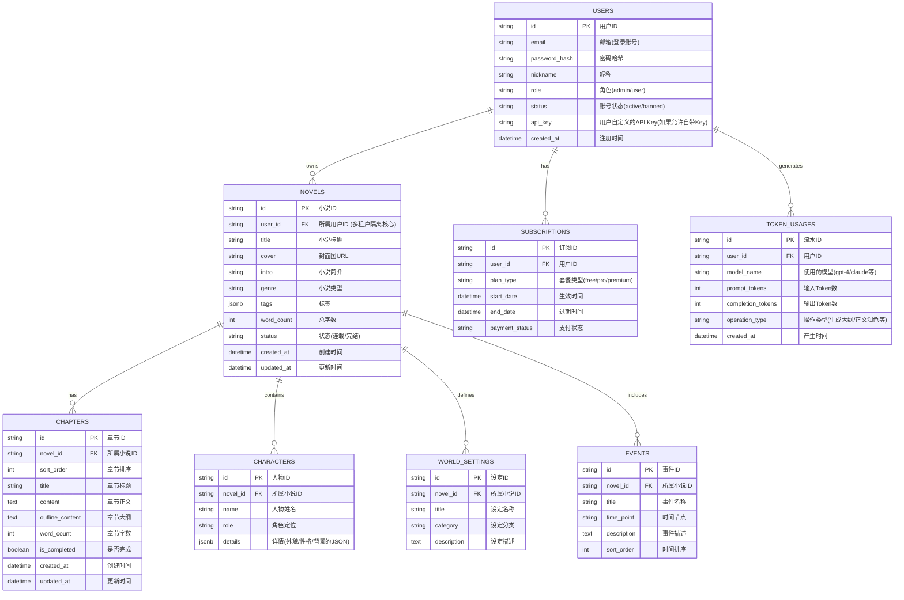

# 灵溪写作后端架构设计 (SaaS 商业化版)

## 1. 技术栈推荐

考虑到您后期计划将其发布为公网 SaaS 产品（支持多租户注册、按月收费），数据库和后端技术栈需要具备良好的扩展性和并发处理能力。

### 推荐组合：

- **后端框架**：`Node.js` + `NestJS` 或 `Express` (NestJS 在商业项目中更规范，适合大型工程；Express 则更敏捷)。推荐使用 **TypeScript** 保证商业代码的健壮性。
- **数据库**：**PostgreSQL** (强烈推荐) 或 MySQL。
  - _原因_：SQLite 适合单机单用户，但在多用户高并发、特别是涉及计费和事务（Transaction）的 SaaS 场景下，PostgreSQL 的表现远超 SQLite，且对 JSON 数据类型支持极佳。
- **ORM**：**Prisma** (开发体验极佳，迁移数据库非常方便)。
- **缓存/队列**：**Redis** (公网产品必备：用于限制 API 请求频率、Token 计费缓存、存储用户登录 Session)。
- **支付接入**：预留对接 Stripe 或 微信/支付宝 的接口能力。

---

## 2. 数据库表结构设计 (SaaS 商业版 ER 图)

为了支持商业化，我们需要引入**多租户隔离 (Tenant Isolation)**、**订阅/会员体系 (Subscription)** 和 **Token 计费 (Billing)** 模块。

### SaaS 商业化改造的核心点：

1. **多租户隔离 (Tenant Isolation)**：所有业务表（如 `NOVELS`）必须包含 `user_id`。后端的每一个查询接口，都必须在 SQL/Prisma 查询条件中带上 `WHERE user_id = 当前登录用户的ID`，防止用户 A 看到用户 B 的小说。
2. **JSONB 数据类型**：PostgreSQL 的 `JSONB` 类型非常强大，适合存储像 `tags`、人物 `details` 这种结构不固定但又需要一定查询能力的字段，能极大简化表结构。
3. **Token 计费与防刷 (Billing & Rate Limiting)**：
   - AI API 的调用成本极高。必须有 `TOKEN_USAGES` 表记录每一笔 Token 开销。
   - 用户请求生成小说前，后端必须先查 `SUBSCRIPTIONS`（套餐额度是否用完），再决定是否放行请求给 OpenAI/Claude。

---

## 3. 后端架构演进路径 (从个人到商业)

罗马不是一天建成的，为了让你能尽快用起来，同时又不影响未来的商业化，建议采取**两阶段策略**：

### 阶段一：个人 MVP (Minimum Viable Product) 阶段

_目标：自己能用，数据存到云端，不丢数据。_

- **数据库**：直接上 PostgreSQL（云厂商如 Supabase, Neon 提供免费的 PG 库，免运维）。
- **后端代码**：写一个简单的 Node.js/Express 服务，暂时不写复杂的注册登录和计费，直接用一个固定的 Token/密码 保护接口。把前端存在 LocalStorage 的数据无缝对接到 PostgreSQL 中。

### 阶段二：SaaS 商业化阶段

_目标：开放注册，接入支付，按月收费。_

- **认证授权**：接入 JWT (JSON Web Token) 机制，支持邮箱验证码注册/登录。
- **计费网关**：把前端直接调用 AI 接口（目前在 `api.js` 里）的逻辑，**全部移到后端**。
  - _原因_：如果让前端直接调大模型，API Key 会暴露，别人可以白嫖你的 Key。必须改成：前端请求你的后端 -> 你的后端扣除用户的会员额度 -> 你的后端调用 OpenAI -> 你的后端把结果流式 (Stream) 返回给前端。
- **支付接入**：对接微信/支付宝，更新 `SUBSCRIPTIONS` 表的状态。

## 4. 当前前端需要为商业化做的准备

如果你现在就要开始改造代码，请注意前端代码 (`src/services/api.js`) 的这部分逻辑未来必须重构：
目前的逻辑是：**前端直接拿着 API Key 去请求 OpenAI**。
商业化的逻辑必须是：**前端拿着用户的 JWT Token 请求你自己的 Node.js 后端 -> 后端鉴权扣费 -> 后端请求 OpenAI**。

**所以当前的开发重点**：
先用 Node.js 把业务数据的增删改查（小说、章节等）的 API 写好，让数据持久化到 PostgreSQL。大模型的调用暂时保留在前端（反正是你自己用），等准备对外发布时，再把大模型调用移到后端。
